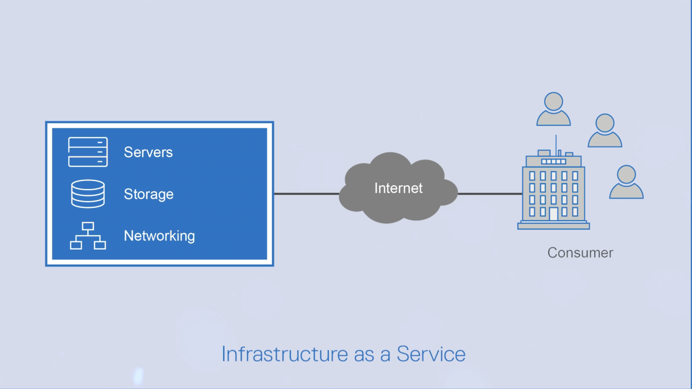
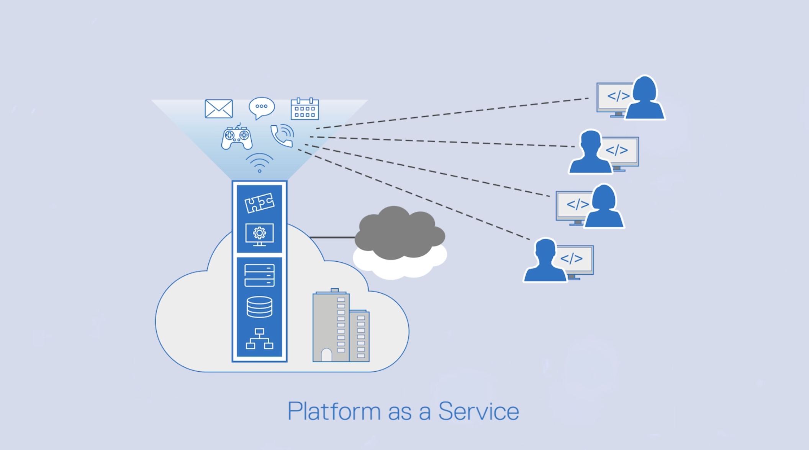
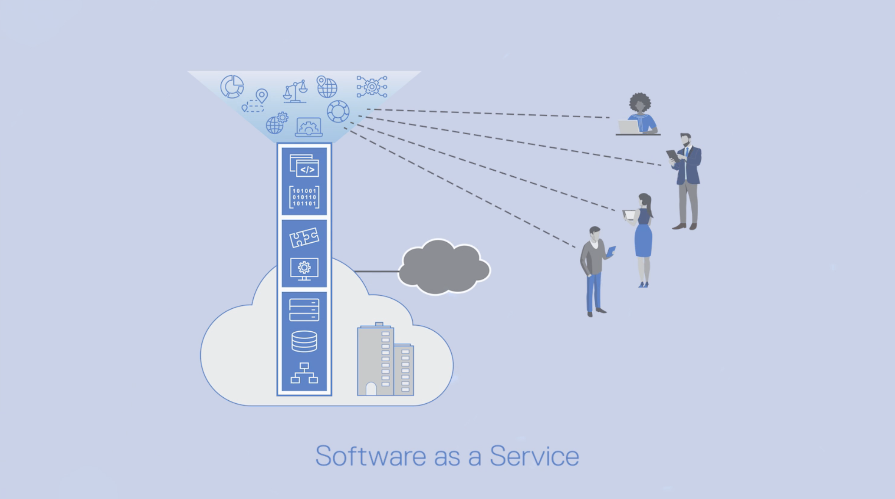
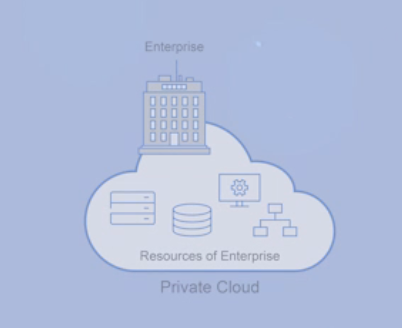
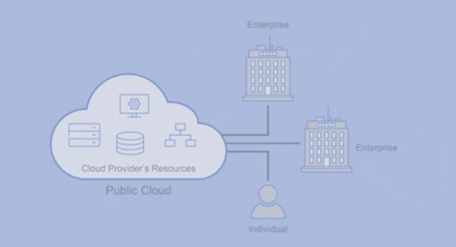
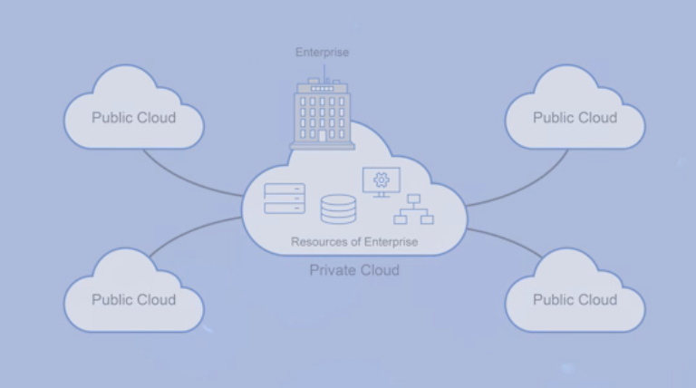

# Introduction to Cloud Computing

## The main objectives of the module are to
 - Define cloud computing and related concepts
 - Identify factors that influence adoption of cloud.
 - Distinguish between the cloud service models.
 - Distinguish between cloud deployment models.
 - Select the best deployment model based on desired strategy.

### Introduction to Cloud Computing
 - Common Cloud Models
   - 

        
Infrastructure as a Service

        
     

   - 

        
Platform as a Service

        
     

   - 

        
Software as a Service

        
     

- Cloud Deployment Models
  - 

        
Private Cloud Deployment Model

         
    

  - 

        
Public Cloud Deployment Model

         
    

  - 

        
Hybrid Cloud Deployment Model

         
    

  - 

        
Multi-Cloud Deployment Model

         
    

